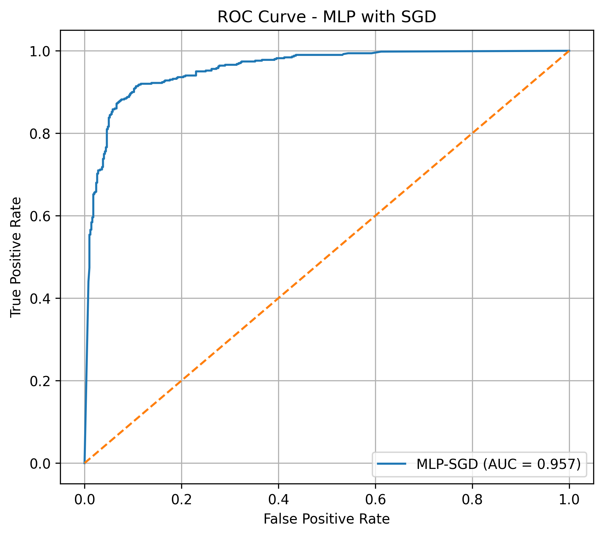
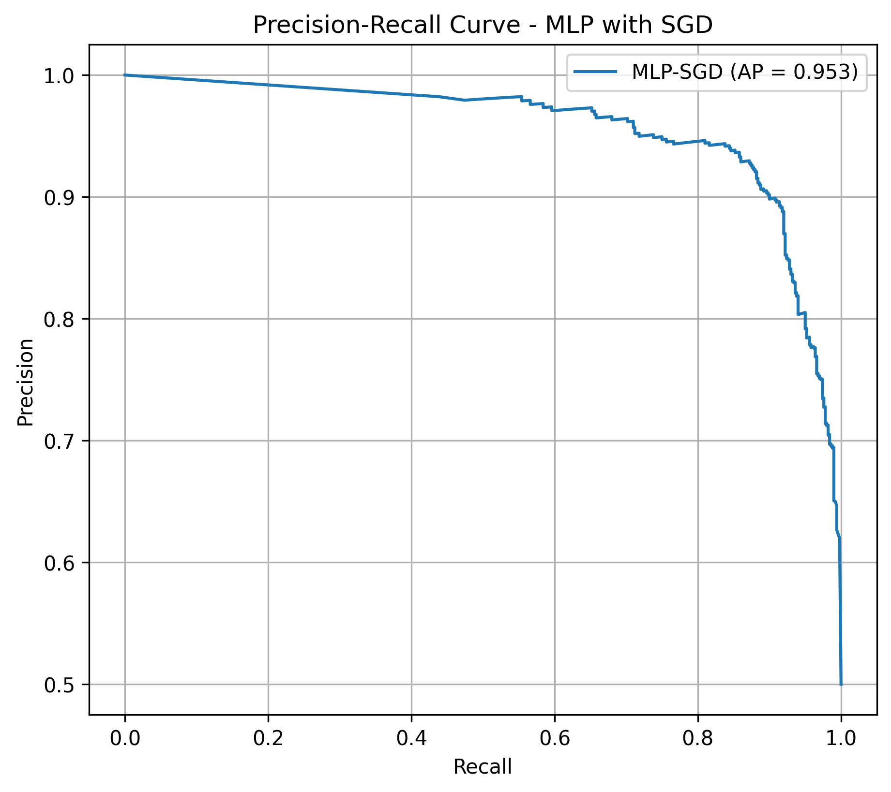

# 🚦 Road Sign & Pedestrian Classification Using PCA and MLP-SGD

A machine learning system for classifying road-scene objects as **pedestrians** or **traffic signs** under varying weather conditions using **Principal Component Analysis (PCA)** and a **Multi-Layer Perceptron (MLP)** optimized with **Stochastic Gradient Descent (SGD)**.

The project uses a balanced subset of the **BDD100K autonomous driving dataset** and evaluates the model using classification metrics, ROC and Precision-Recall curves, 5-fold cross-validation, and weather-wise performance analysis.

> **Note:** The implemented machine learning model performs classification of cropped road objects. It is not an end-to-end object detection/localization system.

---

## 🎯 Objectives

- Classify road-scene objects into **pedestrian** and **traffic sign** categories.
- Reduce high-dimensional image features using **PCA**.
- Determine an appropriate number of PCA components using explained variance.
- Implement an **MLP neural network** for classification.
- Optimize the MLP using **Stochastic Gradient Descent (SGD)**.
- Evaluate the model using accuracy, precision, recall, F1-score, ROC-AUC, and PR-AUC.
- Use **5-fold cross-validation** to assess model stability and reduce dependence on a single data split.
- Analyze model performance under different weather conditions.

---

# 📊 Dataset

The project uses the **BDD100K** autonomous driving dataset.

### Dataset Source

- BDD100K: https://bdd-data.berkeley.edu/
- BDD100K Paper: https://arxiv.org/abs/1805.04687

A balanced subset was created from the BDD100K object annotations.

### Selected Classes

| Class | Samples |
|---|---:|
| Pedestrian | 2,500 |
| Traffic Sign | 2,500 |
| **Total** | **5,000** |

### Weather Distribution

Five weather conditions were selected with equal representation:

| Weather | Samples |
|---|---:|
| Clear | 1,000 |
| Overcast | 1,000 |
| Partly Cloudy | 1,000 |
| Rainy | 1,000 |
| Snowy | 1,000 |
| **Total** | **5,000** |

Only **non-occluded and non-truncated** target objects were selected for the balanced dataset.

---

# 🔄 Methodology

The overall machine learning pipeline is:

```text
                 BDD100K Dataset
                        │
                        ▼
              Object Annotation Filtering
                        │
                        ▼
              Pedestrian / Traffic Sign
                        │
                        ▼
               Balanced Weather Dataset
                        │
                        ▼
                Bounding Box Cropping
                        │
                        ▼
                 32 × 32 Grayscale
                        │
                        ▼
                  1024 Features
                        │
                        ▼
                Standardization
                        │
                        ▼
                       PCA
                        │
                        ▼
                 57 PCA Features
                        │
                        ▼
                  MLP Classifier
                        │
                        ▼
                 SGD Optimization
                        │
                        ▼
              Cross-Validation & Evaluation

---

# 🖼️ Image Preprocessing

The selected objects were extracted using their bounding-box annotations from the BDD100K dataset.

Each cropped image was:

1. Resized to **32 × 32 pixels**
2. Converted to **grayscale**
3. Flattened into a feature vector
4. Standardized before PCA

Therefore, each image initially contains:

```text
32 × 32 = 1,024 features


---

# 📉 PCA Dimensionality Reduction

Principal Component Analysis (PCA) was used to reduce the dimensionality of the standardized image features while retaining the majority of the information in the dataset.

The explained variance analysis produced the following results:

| Explained Variance | PCA Components |
|---:|---:|
| 80% | 8 |
| 85% | 14 |
| 90% | 25 |
| **95%** | **57** |
| 99% | 198 |

Based on the explained variance analysis, **57 PCA components** were selected, retaining approximately **95% of the original variance**.

The dimensionality was therefore reduced from:

```text
1,024 → 57 features


---

# 🤖 MLP Neural Network

A Multi-Layer Perceptron (MLP) was implemented to classify the PCA-reduced image features into two classes:

- Pedestrian
- Traffic Sign

### Architecture

```text
Input Layer
57 PCA Features
      │
      ▼
Hidden Layer
128 Neurons
      │
      ▼
Hidden Layer
64 Neurons
      │
      ▼
Output Layer
2 Classes


---

# ⚙️ SGD Optimization

The MLP was optimized using **Stochastic Gradient Descent (SGD)**.

Different combinations of learning rate and momentum were evaluated to identify the best-performing configuration.

| Learning Rate | Momentum | Validation Accuracy |
|---:|---:|---:|
| 0.0001 | 0.00 | 77.30% |
| 0.0001 | 0.90 | 83.70% |
| 0.0001 | 0.95 | 85.10% |
| 0.001 | 0.00 | 83.90% |
| 0.001 | 0.90 | 89.60% |
| 0.001 | 0.95 | 89.50% |
| 0.01 | 0.00 | 89.00% |
| 0.01 | 0.90 | 90.10% |
| **0.01** | **0.95** | **90.30%** |

The best-performing configuration was:

```text
Learning Rate = 0.01
Momentum      = 0.95


---

# 📈 Model Evaluation

The optimized model was evaluated using:

- Accuracy
- Precision
- Recall
- F1-score
- ROC-AUC
- Precision-Recall AUC
- Confusion Matrix

## Hold-Out Validation Results

| Metric | Result |
|---|---:|
| Accuracy | **90.30%** |
| Pedestrian Precision | **92.60%** |
| Pedestrian Recall | **87.60%** |
| Pedestrian F1-score | **90.03%** |
| ROC-AUC | **0.9566** |
| PR-AUC | **0.9525** |

---

# 🔢 Confusion Matrix

The confusion matrix obtained on the validation set was:

```text
                    Predicted
                 Pedestrian   Sign

Actual
Pedestrian          438        62
Traffic Sign         35       465


---

## Part 7 — ROC Curve

```markdown
---

# 📊 ROC Curve



The model achieved a **ROC-AUC of 0.9566**, indicating strong class discrimination across different classification thresholds.

---

# 📌 Precision-Recall Curve



The model achieved a **PR-AUC of 0.9525**, showing strong precision-recall performance.


---

# 🔬 5-Fold Cross-Validation

To assess the stability of the model and reduce dependence on a single train-validation split, **Stratified 5-Fold Cross-Validation** was performed.

The cross-validation pipeline applies preprocessing within each fold:

```text
StandardScaler
      ↓
PCA (95% explained variance)
      ↓
MLP + SGD


---


# 🌦️ Weather-wise Performance

The model was additionally evaluated under the five selected weather conditions using out-of-fold predictions.

| Weather | Samples | Accuracy | Precision | Recall | F1-score |
|---|---:|---:|---:|---:|---:|
| Clear | 1,000 | 91.20% | 91.31% | 91.20% | 91.19% |
| Overcast | 1,000 | 90.90% | 90.90% | 90.90% | 90.90% |
| Partly Cloudy | 1,000 | 89.50% | 89.50% | 89.50% | 89.50% |
| Rainy | 1,000 | 90.90% | 90.90% | 90.90% | 90.90% |
| Snowy | 1,000 | **92.70%** | **92.71%** | **92.70%** | **92.70%** |

### Observation

The model maintained relatively consistent performance across the selected weather conditions.

- **Best performance:** Snowy — 92.70%
- **Lowest performance:** Partly Cloudy — 89.50%
- **Performance range:** 3.20 percentage points

This indicates that the model was reasonably robust to the weather variations represented in the selected dataset.


---

# 🛠️ Technologies Used

### Programming & Libraries

- Python
- NumPy
- Pandas
- Scikit-learn
- Pillow
- Matplotlib
- Seaborn
- Jupyter Notebook

### Machine Learning Techniques

- Image preprocessing
- Feature standardization
- Principal Component Analysis (PCA)
- Multi-Layer Perceptron (MLP)
- Stochastic Gradient Descent (SGD)
- Stratified K-Fold Cross-Validation
- ROC analysis
- Precision-Recall analysis


---

# 📌 Key Results

```text
PCA
────────────────────────────
Original Features : 1,024
PCA Features      : 57
Variance Retained : ~95%

MLP + SGD
────────────────────────────
Architecture      : 57 → 128 → 64 → 2
Learning Rate     : 0.01
Momentum          : 0.95
Optimizer         : SGD

Hold-Out Validation
────────────────────────────
Accuracy          : 90.30%
ROC-AUC           : 0.9566
PR-AUC            : 0.9525

5-Fold Cross-Validation
────────────────────────────
Accuracy          : 91.04% ± 0.65%
Precision         : 91.08% ± 0.64%
Recall            : 91.04% ± 0.65%
F1-score          : 91.04% ± 0.65%

Weather Evaluation
────────────────────────────
Best Accuracy     : 92.70% (Snowy)
Lowest Accuracy   : 89.50% (Partly Cloudy)


---

# 👩‍💻 Author

**Aswana N.**

B.Tech Electronics and Communication Engineering  
NSS College of Engineering, Palakkad

---

## ⭐ Project Highlights

> **PCA-based dimensionality reduction + optimized MLP with SGD + 5-fold cross-validation + weather-wise evaluation for road-sign and pedestrian classification.**